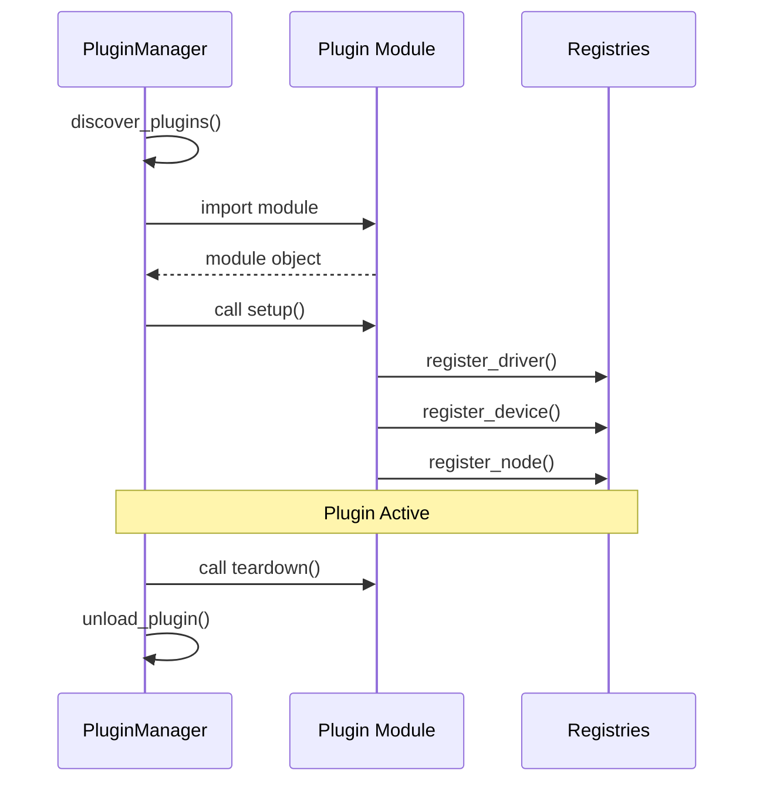

# Plugins API Reference

This document covers the plugin system for extending GLIDER.

## Overview

GLIDER's plugin system allows extensions to provide:
- **Board Drivers** - Support for new hardware platforms
- **Device Types** - New sensor/actuator abstractions
- **Node Types** - Custom flow graph nodes
- **UI Components** - Dashboard widgets (future)

**Module:** `glider.plugins`

---

## PluginManager

Manages plugin discovery, loading, and lifecycle.

**Module:** `glider.plugins.plugin_manager`

### Constructor

```python
PluginManager(plugin_dirs: Optional[List[Path]] = None)
```

**Parameters:**
- `plugin_dirs`: Additional directories to search for plugins

**Default plugin directory:** `~/.glider/plugins`

### Properties

| Property | Type | Description |
|----------|------|-------------|
| `plugins` | `Dict[str, PluginInfo]` | All discovered plugins |
| `loaded_plugins` | `Dict[str, PluginInfo]` | Currently loaded plugins |

### Methods

#### Discovery

##### `async discover_plugins() -> List[PluginInfo]`

Discover all available plugins from entry points and plugin directories.

```python
manager = PluginManager()
plugins = await manager.discover_plugins()
for plugin in plugins:
    print(f"Found: {plugin.name} v{plugin.version}")
```

**Returns:** List of discovered `PluginInfo` objects

##### `get_plugin(name: str) -> Optional[PluginInfo]`

Get a plugin by name.

```python
plugin = manager.get_plugin("my_plugin")
if plugin:
    print(f"Plugin loaded: {plugin.loaded}")
```

#### Loading

##### `async load_plugins() -> Dict[str, bool]`

Load all enabled plugins.

```python
results = await manager.load_plugins()
for name, success in results.items():
    print(f"{name}: {'loaded' if success else 'failed'}")
```

**Returns:** Dictionary mapping plugin names to success status

##### `async load_plugin(name: str) -> bool`

Load a specific plugin.

```python
success = await manager.load_plugin("my_plugin")
```

**Behavior:**
1. Adds plugin path to `sys.path`
2. Imports the plugin module
3. Calls `setup()` function if present
4. Registers plugin components

**Returns:** `True` if loaded successfully

##### `async unload_plugin(name: str) -> bool`

Unload a specific plugin.

```python
success = await manager.unload_plugin("my_plugin")
```

**Behavior:**
1. Calls `teardown()` function if present
2. Marks plugin as not loaded

##### `async unload_all() -> None`

Unload all loaded plugins.

##### `async reload_plugin(name: str) -> bool`

Reload a plugin (unload then load).

```python
success = await manager.reload_plugin("my_plugin")
```

#### Plugin Control

##### `enable_plugin(name: str) -> bool`

Enable a plugin for loading.

```python
manager.enable_plugin("my_plugin")
```

##### `disable_plugin(name: str) -> bool`

Disable a plugin (won't be loaded).

```python
manager.disable_plugin("my_plugin")
```

#### Dependencies

##### `async install_requirements(name: str) -> bool`

Install pip requirements for a plugin.

```python
success = await manager.install_requirements("my_plugin")
```

#### Utilities

##### `get_plugin_info_list() -> List[Dict[str, Any]]`

Get all plugins as dictionaries.

```python
plugins = manager.get_plugin_info_list()
for p in plugins:
    print(f"{p['name']}: {p['version']}")
```

---

## PluginInfo

Information about a plugin.

**Module:** `glider.plugins.plugin_manager`

```python
@dataclass
class PluginInfo:
    name: str
    version: str = "1.0.0"
    description: str = ""
    author: str = ""
    entry_point: str = ""        # e.g., "my_plugin:setup"
    plugin_type: str = "generic" # "driver", "device", "node", "generic"
    requirements: List[str] = []
    enabled: bool = True
    loaded: bool = False
    module: Optional[Any] = None
    error: Optional[str] = None
    path: Optional[str] = None
```

### Properties

| Property | Type | Description |
|----------|------|-------------|
| `name` | str | Plugin name |
| `version` | str | Semantic version |
| `description` | str | Brief description |
| `author` | str | Author name/email |
| `entry_point` | str | Module:function to call |
| `plugin_type` | str | Plugin category |
| `requirements` | List[str] | pip dependencies |
| `enabled` | bool | Whether enabled |
| `loaded` | bool | Whether currently loaded |
| `module` | Any | Loaded Python module |
| `error` | str | Error message if failed |
| `path` | str | File system path |

### Methods

##### `to_dict() -> Dict[str, Any]`

Serialize to dictionary.

##### `from_dict(data) -> PluginInfo` (classmethod)

Create from dictionary.

---

## Plugin Discovery

### Entry Points

Plugins can be discovered via Python entry points in `pyproject.toml`:

```toml
[project.entry-points."glider.driver"]
my_board = "my_plugin.drivers:MyBoard"

[project.entry-points."glider.device"]
my_sensor = "my_plugin.devices:MySensor"

[project.entry-points."glider.node"]
my_node = "my_plugin.nodes:MyNode"
```

**Supported entry point groups:**
- `glider.driver` - Board drivers
- `glider.device` - Device types
- `glider.node` - Node types

### Plugin Directory

Plugins can also be placed in the plugin directory:

```
~/.glider/plugins/
└── my_plugin/
    ├── __init__.py
    ├── manifest.json
    └── ...
```

---

## Manifest File

Optional metadata file for directory plugins:

**`manifest.json`:**
```json
{
  "name": "My GLIDER Plugin",
  "version": "1.0.0",
  "description": "Adds custom functionality",
  "author": "Your Name",
  "entry_point": "my_plugin:setup",
  "plugin_type": "generic",
  "requirements": [
    "numpy>=1.20.0"
  ],
  "enabled": true
}
```

### Fields

| Field | Required | Description |
|-------|----------|-------------|
| `name` | Yes | Display name |
| `version` | No | Semantic version (default: "1.0.0") |
| `description` | No | Brief description |
| `author` | No | Author name/email |
| `entry_point` | No | Module:function to call |
| `plugin_type` | No | "driver", "device", "node", or "generic" |
| `requirements` | No | List of pip packages |
| `enabled` | No | Whether to load (default: true) |

---

## Plugin Structure

### Basic Plugin

```python
# my_plugin/__init__.py
"""My GLIDER Plugin."""

__version__ = "1.0.0"

def setup():
    """Called when plugin loads."""
    print("Plugin loaded!")

def teardown():
    """Called when plugin unloads."""
    print("Plugin unloaded!")
```

### Component Registration

Plugins can automatically register components using module-level dictionaries:

```python
# my_plugin/__init__.py

from .drivers import MyBoard
from .devices import MySensor
from .nodes import MyNode

# Board drivers
BOARD_DRIVERS = {
    "my_board": MyBoard,
}

# Device types
DEVICE_TYPES = {
    "MySensor": MySensor,
}

# Node types
NODE_TYPES = {
    "MyNode": MyNode,
}
```

The PluginManager automatically detects and registers these dictionaries.

### Manual Registration

For more control, register components in the `setup()` function:

```python
def setup():
    from glider.core.hardware_manager import HardwareManager
    from glider.core.flow_engine import FlowEngine
    from glider.hal.base_device import DEVICE_REGISTRY

    HardwareManager.register_driver("my_board", MyBoard)
    DEVICE_REGISTRY["MySensor"] = MySensor
    FlowEngine.register_node("MyNode", MyNode)
```

---

## Async Support

Setup and teardown functions can be async:

```python
async def setup():
    """Async setup."""
    await initialize_hardware()

async def teardown():
    """Async cleanup."""
    await close_connections()
```

The PluginManager detects async functions and awaits them.

---

## Error Handling

Plugin loading errors are captured in `PluginInfo.error`:

```python
plugin = manager.get_plugin("my_plugin")
if not plugin.loaded and plugin.error:
    print(f"Plugin failed: {plugin.error}")
```

### Error Types

| Error | Cause |
|-------|-------|
| `Module not found: xyz` | Missing dependency |
| `Import error: ...` | Import failure |
| `Syntax error in file:line` | Python syntax error |
| `Missing attribute: ...` | Missing setup function |
| `Type error during setup` | Setup function signature mismatch |
| `File not found: ...` | Plugin file missing |
| `Permission denied: ...` | Cannot read plugin file |

---

## Plugin Lifecycle



---

## Example: Complete Plugin

```python
# temperature_plugin/__init__.py
"""Temperature sensor plugin for GLIDER."""

__version__ = "1.0.0"

from glider.hal.base_device import BaseDevice, DeviceConfig
from glider.nodes.base_node import GliderNode, NodeDefinition, NodeCategory, PortDefinition, PortType


class TemperatureSensor(BaseDevice):
    """DHT22 temperature sensor."""

    device_type = "TemperatureSensor"
    required_pins = ["data"]

    @property
    def actions(self):
        return {"read": self.read_temperature}

    async def initialize(self):
        pin = self.config.pins["data"]
        await self.board.set_pin_mode(pin, "INPUT")
        self._initialized = True

    async def shutdown(self):
        self._initialized = False

    async def read_temperature(self):
        # Read from DHT22
        return 25.0  # Placeholder


class ReadTemperatureNode(GliderNode):
    """Read temperature from sensor."""

    definition = NodeDefinition(
        name="ReadTemperature",
        category=NodeCategory.HARDWARE,
        inputs=[
            PortDefinition("exec", PortType.EXEC),
        ],
        outputs=[
            PortDefinition("celsius", PortType.DATA),
            PortDefinition("next", PortType.EXEC),
        ],
    )

    async def execute(self):
        if self._device:
            temp = await self._device.read_temperature()
            self.set_output(0, temp)
        self.exec_output(1)


# Auto-registration
DEVICE_TYPES = {
    "TemperatureSensor": TemperatureSensor,
}

NODE_TYPES = {
    "ReadTemperature": ReadTemperatureNode,
}


def setup():
    import logging
    logging.info("Temperature plugin loaded")


def teardown():
    pass
```

---

## See Also

- [Plugin Development](../developer-guide/plugin-development.md) - Development guide
- [Custom Nodes](../developer-guide/custom-nodes.md) - Node development
- [Custom Drivers](../developer-guide/custom-drivers.md) - Driver development
- [Custom Devices](../developer-guide/custom-devices.md) - Device development
