# Architecture

This document provides an in-depth look at GLIDER's architecture for developers extending or modifying the system.

## Overview

GLIDER is a modular experimental orchestration platform built with:

- **Python 3.9+** for the core logic
- **PyQt6** for the graphical interface
- **asyncio** for non-blocking hardware operations
- **qasync** for Qt/asyncio integration

## System Architecture

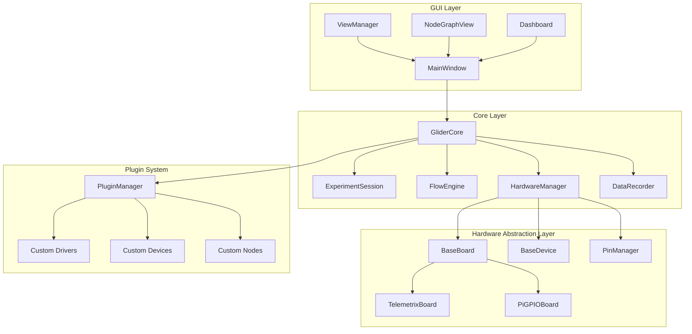

## Project Structure

```
glider/
├── src/glider/
│   ├── __init__.py          # Package initialization
│   ├── __main__.py          # CLI entry point
│   ├── core/                # Core orchestration
│   │   ├── glider_core.py   # Main orchestrator
│   │   ├── experiment_session.py  # Session model
│   │   ├── flow_engine.py   # Flow execution
│   │   ├── hardware_manager.py    # Hardware lifecycle
│   │   └── data_recorder.py # Data logging
│   ├── gui/                 # User interface
│   │   ├── main_window.py   # Primary window
│   │   ├── view_manager.py  # Mode detection
│   │   ├── node_graph/      # Visual editor
│   │   └── runner/          # Touch dashboard
│   ├── hal/                 # Hardware abstraction
│   │   ├── base_board.py    # Board interface
│   │   ├── base_device.py   # Device interface
│   │   ├── pin_manager.py   # Pin allocation
│   │   └── boards/          # Board implementations
│   ├── nodes/               # Node system
│   │   ├── base_node.py     # Base node class
│   │   ├── experiment_nodes.py   # Flow control
│   │   ├── hardware/        # Hardware nodes
│   │   ├── logic/           # Logic nodes
│   │   └── interface/       # UI nodes
│   ├── plugins/             # Plugin system
│   │   └── plugin_manager.py
│   └── serialization/       # Save/load
│       ├── schema.py        # Data schemas
│       └── serializer.py    # File operations
├── docs/                    # Documentation
├── tests/                   # Test suite
└── pyproject.toml          # Package config
```

## Core Components

### GliderCore

The central orchestrator managing the entire system lifecycle.

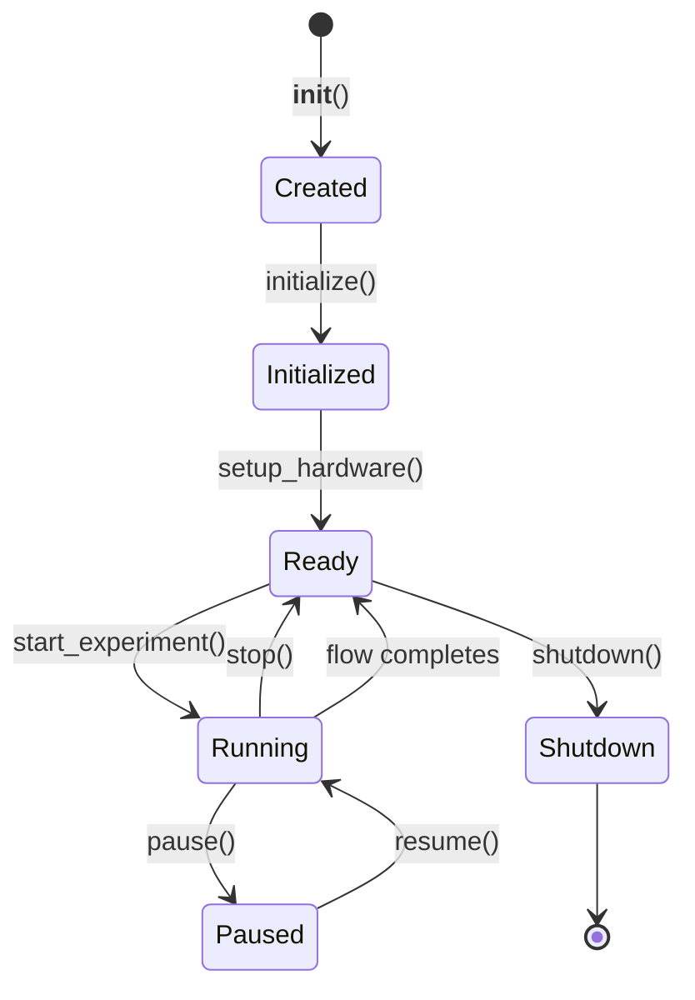

**Responsibilities:**
- Event loop initialization
- Plugin loading and management
- Session lifecycle coordination
- Hardware connection management
- Error handling and callbacks

**Key Methods:**
```python
async def initialize(self) -> None
async def setup_hardware(self) -> None
async def start_experiment(self) -> None
async def stop_experiment(self) -> None
async def pause() -> None
async def resume() -> None
async def emergency_stop() -> None
async def shutdown() -> None
```

### ExperimentSession

The data model representing complete experiment state.

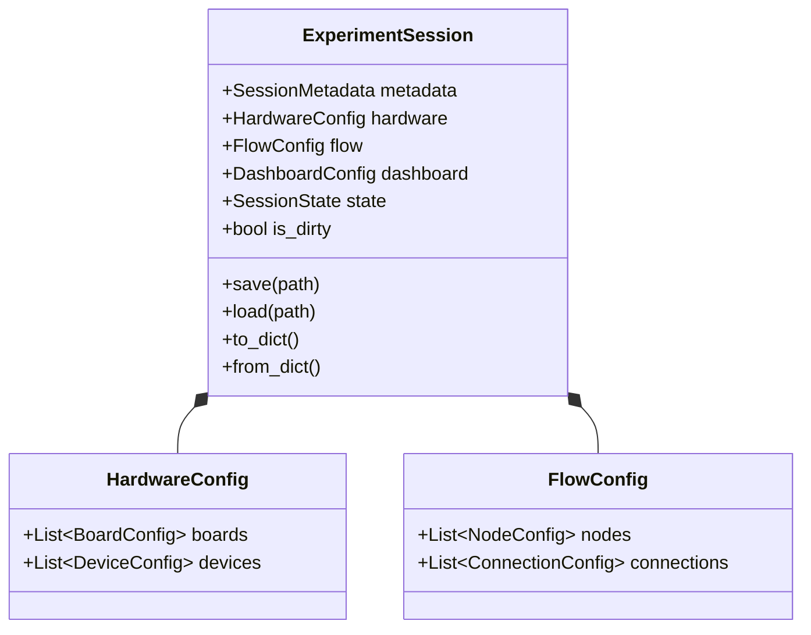

**State Machine:**
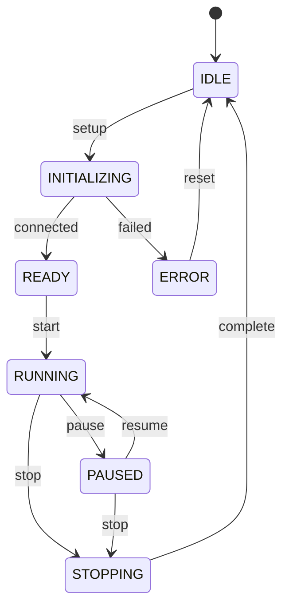

### FlowEngine

Executes the visual flow graph with support for both data flow (reactive) and execution flow (imperative).

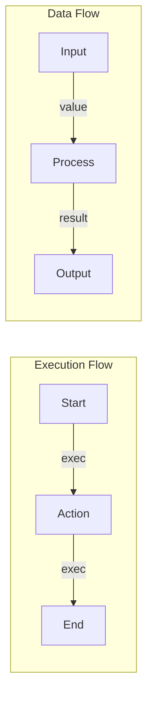

**Execution Model:**
1. **Execution Flow**: White connections control when nodes run
2. **Data Flow**: Colored connections pass values between nodes
3. **Hybrid**: A node can have both exec and data ports

### HardwareManager

Manages the lifecycle of hardware boards and devices.

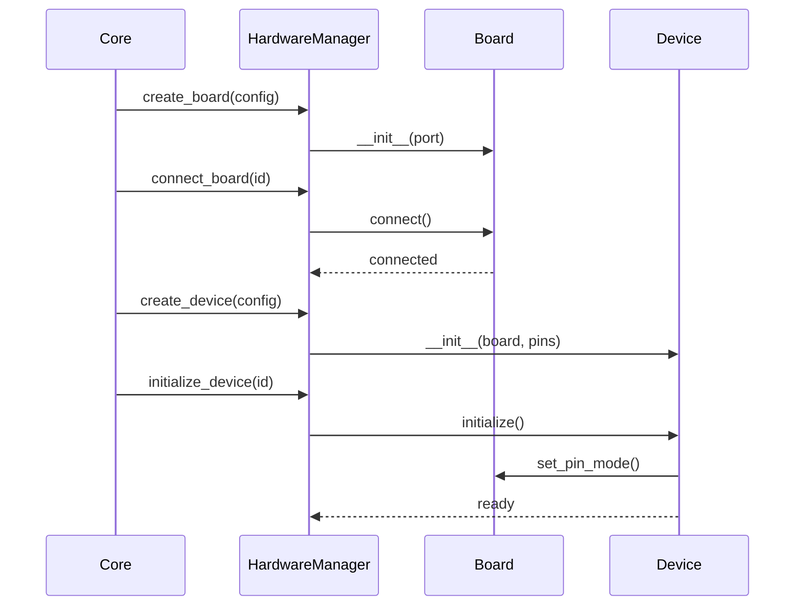

## Hardware Abstraction Layer

### Board Hierarchy

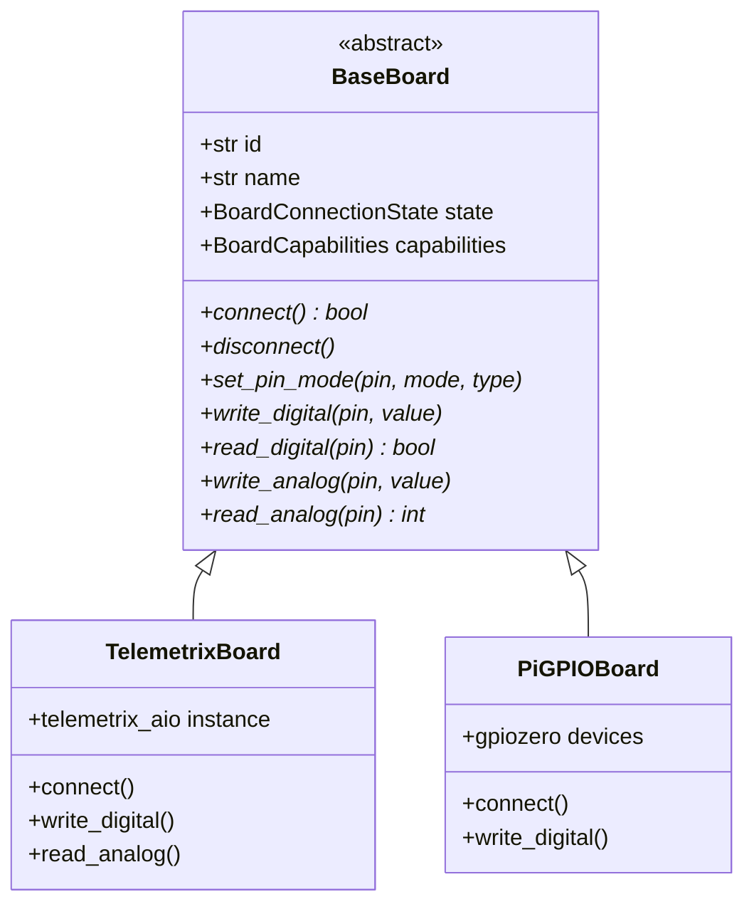

### Device Hierarchy

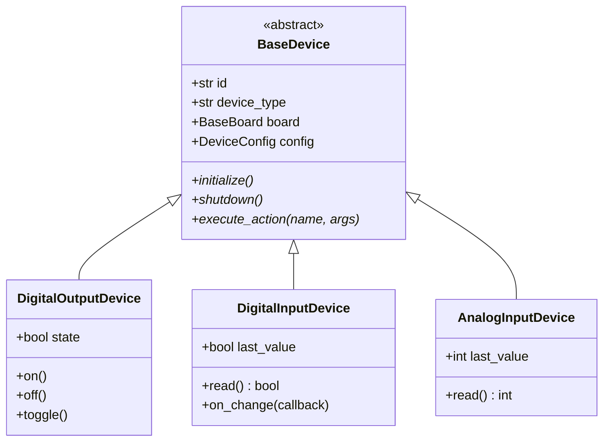

## Node System

### Node Categories

| Category | Color | Purpose |
|----------|-------|---------|
| Hardware | Green | Device interaction |
| Logic | Blue | Data processing |
| Interface | Orange | User interaction |
| Script | Purple | Custom code |
| Experiment | White | Flow control |

### Node Structure

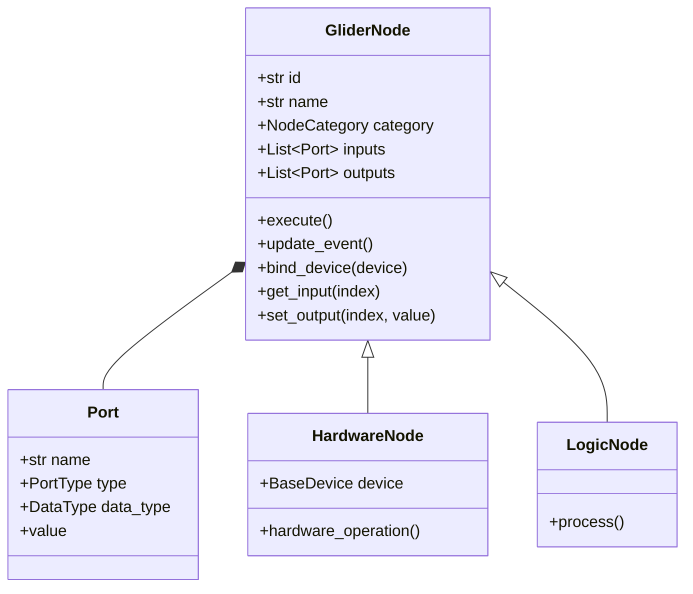

## Data Flow

### Experiment Lifecycle

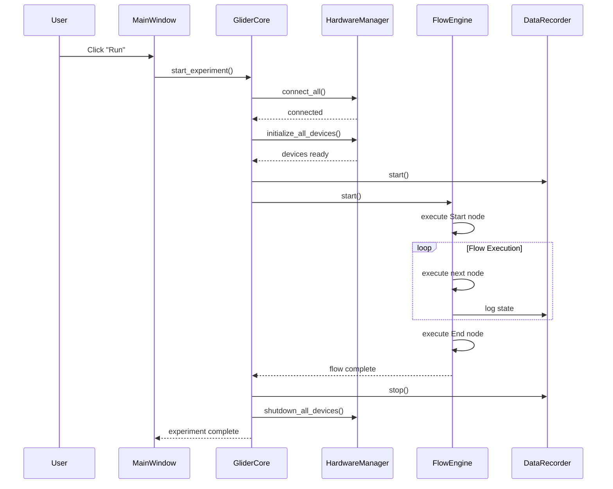

### File Serialization

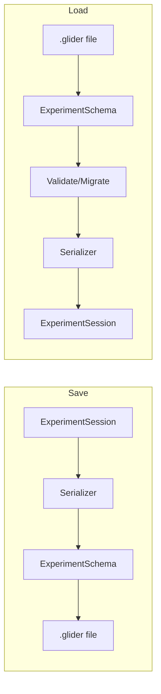

## Design Patterns

### State Machines

All major components use state machines for lifecycle management:

- **SessionState**: Experiment lifecycle
- **FlowState**: Flow engine status
- **BoardConnectionState**: Hardware connection

### Registry Pattern

Components are registered and discovered dynamically:

```python
# Node registration
FlowEngine.register_node("DigitalWrite", DigitalWriteNode)

# Driver registration
HardwareManager.register_driver("arduino", TelemetrixBoard)

# Device registration
DEVICE_REGISTRY["DigitalOutput"] = DigitalOutputDevice
```

### Observer/Callback Pattern

All components support callbacks for state changes:

```python
core.on_state_change(lambda state: print(f"State: {state}"))
core.on_error(lambda src, err: log.error(f"{src}: {err}"))
board.register_state_callback(handle_connection_change)
```

### Async/Await Pattern

All I/O operations are non-blocking:

```python
async def connect_hardware(self):
    for board in self.boards.values():
        await board.connect()  # Non-blocking
    for device in self.devices.values():
        await device.initialize()  # Non-blocking
```

## Extension Points

GLIDER is designed for extensibility at multiple levels:

| Extension | Base Class | Registration |
|-----------|------------|--------------|
| Board Drivers | `BaseBoard` | `HardwareManager.register_driver()` |
| Device Types | `BaseDevice` | `DEVICE_REGISTRY[name] = class` |
| Node Types | `GliderNode` | `FlowEngine.register_node()` |
| Plugins | N/A | Entry points or plugin directory |

## Threading Model

GLIDER uses a single-threaded async model:

1. **Main Thread**: Qt event loop + asyncio via qasync
2. **Hardware I/O**: Async operations (no blocking)
3. **Task Tracking**: All async tasks tracked for cleanup

```python
# Task tracking example
self._pending_tasks.add(task)
task.add_done_callback(self._pending_tasks.discard)
```

## See Also

- [Plugin Development](plugin-development.md) - Create plugins
- [Custom Nodes](custom-nodes.md) - Build nodes
- [Custom Drivers](custom-drivers.md) - Hardware drivers
- [API Reference](../api-reference/core.md) - Complete API
