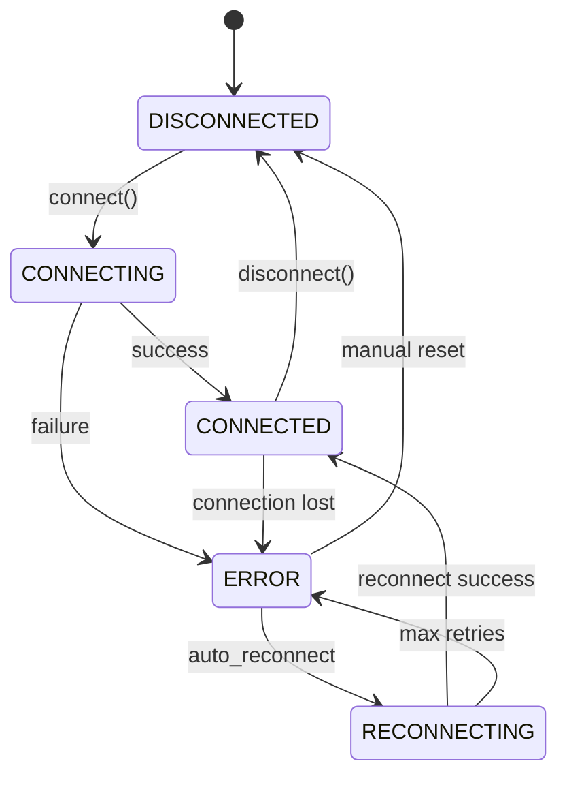

# Custom Drivers

This guide covers creating custom board drivers to support new hardware platforms in GLIDER.

## Overview

A board driver provides the interface between GLIDER and a specific hardware platform. Drivers implement the `BaseBoard` abstract class.

## Built-in Drivers

| Driver | Platform | Communication |
|--------|----------|---------------|
| `TelemetrixBoard` | Arduino | Serial/USB |
| `PiGPIOBoard` | Raspberry Pi | Local GPIO |

## BaseBoard Interface

All drivers must implement the `BaseBoard` abstract class:

```python
from abc import abstractmethod
from glider.hal.base_board import (
    BaseBoard,
    BoardCapabilities,
    BoardConnectionState,
    PinType,
    PinMode,
    PinCapability,
)

class MyBoard(BaseBoard):
    """Custom board driver."""

    @property
    @abstractmethod
    def name(self) -> str:
        """Human-readable board name."""
        ...

    @property
    @abstractmethod
    def capabilities(self) -> BoardCapabilities:
        """Board capabilities map."""
        ...

    @abstractmethod
    async def connect(self) -> bool:
        """Establish connection."""
        ...

    @abstractmethod
    async def disconnect(self) -> None:
        """Close connection."""
        ...

    @abstractmethod
    async def set_pin_mode(
        self, pin: int, mode: PinMode, pin_type: PinType = PinType.DIGITAL
    ) -> None:
        """Configure a pin."""
        ...

    @abstractmethod
    async def write_digital(self, pin: int, value: bool) -> None:
        """Write digital value."""
        ...

    @abstractmethod
    async def read_digital(self, pin: int) -> bool:
        """Read digital value."""
        ...

    @abstractmethod
    async def write_analog(self, pin: int, value: int) -> None:
        """Write analog/PWM value."""
        ...

    @abstractmethod
    async def read_analog(self, pin: int) -> int:
        """Read analog value."""
        ...
```

## Creating a Driver

### Step 1: Define Capabilities

```python
from glider.hal.base_board import (
    BaseBoard,
    BoardCapabilities,
    BoardConnectionState,
    PinCapability,
    PinType,
    PinMode,
)

# Define pin capabilities
MY_BOARD_PINS = {
    0: PinCapability(0, {PinType.DIGITAL}, description="GPIO0"),
    1: PinCapability(1, {PinType.DIGITAL}, description="GPIO1"),
    2: PinCapability(2, {PinType.DIGITAL, PinType.PWM}, max_value=255, description="GPIO2/PWM"),
    3: PinCapability(3, {PinType.ANALOG}, max_value=1023, description="ADC0"),
}
```

### Step 2: Implement the Class

```python
import asyncio
import logging
from typing import Optional, Dict, Any

logger = logging.getLogger(__name__)

class MyCustomBoard(BaseBoard):
    """Driver for My Custom Board."""

    def __init__(
        self,
        port: Optional[str] = None,
        auto_reconnect: bool = False,
        **kwargs
    ):
        super().__init__(port, auto_reconnect)
        self._connection = None
        self._pin_states: Dict[int, Any] = {}

    @property
    def name(self) -> str:
        return "My Custom Board"

    @property
    def capabilities(self) -> BoardCapabilities:
        return BoardCapabilities(
            name=self.name,
            pins=MY_BOARD_PINS,
            supports_analog=True,
            analog_resolution=10,  # 10-bit ADC
            pwm_resolution=8,      # 8-bit PWM
            pwm_frequency=1000,    # 1kHz
            i2c_buses=[0],
            spi_buses=[],
        )

    async def connect(self) -> bool:
        """Establish connection to the board."""
        try:
            self._set_state(BoardConnectionState.CONNECTING)
            logger.info(f"Connecting to {self.name} on {self._port}...")

            # Your connection logic here
            # Example: Serial connection
            import serial_asyncio
            self._reader, self._writer = await serial_asyncio.open_serial_connection(
                url=self._port,
                baudrate=115200
            )

            self._set_state(BoardConnectionState.CONNECTED)
            logger.info(f"Connected to {self.name}")
            return True

        except Exception as e:
            logger.error(f"Connection failed: {e}")
            self._set_state(BoardConnectionState.ERROR)
            self._notify_error(e)
            return False

    async def disconnect(self) -> None:
        """Close the connection."""
        self.stop_reconnect()

        if self._writer:
            self._writer.close()
            await self._writer.wait_closed()

        self._connection = None
        self._set_state(BoardConnectionState.DISCONNECTED)
        logger.info(f"Disconnected from {self.name}")

    async def set_pin_mode(
        self,
        pin: int,
        mode: PinMode,
        pin_type: PinType = PinType.DIGITAL
    ) -> None:
        """Configure a pin's mode."""
        if not self.is_connected:
            raise RuntimeError("Board not connected")

        # Validate pin supports the type
        capability = self.capabilities.pins.get(pin)
        if capability is None:
            raise ValueError(f"Invalid pin: {pin}")
        if pin_type not in capability.supported_types:
            raise ValueError(f"Pin {pin} does not support {pin_type}")

        # Send configuration command to board
        await self._send_command(f"MODE {pin} {mode.name} {pin_type.name}")
        logger.debug(f"Set pin {pin} to {mode.name} ({pin_type.name})")

    async def write_digital(self, pin: int, value: bool) -> None:
        """Write a digital value to a pin."""
        if not self.is_connected:
            raise RuntimeError("Board not connected")

        await self._send_command(f"DWRITE {pin} {1 if value else 0}")
        self._pin_states[pin] = value

    async def read_digital(self, pin: int) -> bool:
        """Read a digital value from a pin."""
        if not self.is_connected:
            raise RuntimeError("Board not connected")

        response = await self._send_command(f"DREAD {pin}")
        value = bool(int(response))
        self._pin_states[pin] = value
        return value

    async def write_analog(self, pin: int, value: int) -> None:
        """Write an analog (PWM) value to a pin."""
        if not self.is_connected:
            raise RuntimeError("Board not connected")

        # Clamp to valid range
        value = max(0, min(255, value))
        await self._send_command(f"AWRITE {pin} {value}")
        self._pin_states[pin] = value

    async def read_analog(self, pin: int) -> int:
        """Read an analog value from a pin."""
        if not self.is_connected:
            raise RuntimeError("Board not connected")

        response = await self._send_command(f"AREAD {pin}")
        value = int(response)
        self._pin_states[pin] = value
        return value

    async def emergency_stop(self) -> None:
        """Set all outputs to safe state."""
        logger.warning("Emergency stop triggered!")
        for pin, capability in self.capabilities.pins.items():
            if PinType.DIGITAL in capability.supported_types:
                try:
                    await self.write_digital(pin, False)
                except Exception as e:
                    logger.error(f"Emergency stop failed for pin {pin}: {e}")

    # Helper methods

    async def _send_command(self, command: str) -> str:
        """Send a command and wait for response."""
        self._writer.write(f"{command}\n".encode())
        await self._writer.drain()

        response = await self._reader.readline()
        return response.decode().strip()
```

## Connection States

Manage connection state properly:



Use `_set_state()` to update state and notify listeners:

```python
self._set_state(BoardConnectionState.CONNECTING)
# ... connection logic ...
self._set_state(BoardConnectionState.CONNECTED)
```

## Callbacks

### Error Callbacks

Notify when errors occur:

```python
try:
    # operation
except Exception as e:
    self._notify_error(e)
```

### Value Callbacks

For boards that push data (like Telemetrix):

```python
def _on_pin_change(self, pin: int, value: Any):
    """Handle async pin value changes."""
    self._notify_callbacks(pin, value)
```

## Auto-Reconnection

Support automatic reconnection:

```python
async def connect(self) -> bool:
    try:
        # connection logic
        self._set_state(BoardConnectionState.CONNECTED)
        return True
    except Exception as e:
        self._set_state(BoardConnectionState.ERROR)
        if self._auto_reconnect:
            self.start_reconnect()
        return False
```

The base class provides `start_reconnect()` and `stop_reconnect()`.

## Serialization

Support saving/loading board configuration:

```python
def to_dict(self) -> Dict[str, Any]:
    """Serialize board configuration."""
    return {
        "id": self._id,
        "name": self.name,
        "port": self._port,
        "auto_reconnect": self._auto_reconnect,
        "board_type": "my_custom_board",
        # Add custom settings
        "baud_rate": self._baud_rate,
    }

@classmethod
def from_dict(cls, data: Dict[str, Any]) -> "MyCustomBoard":
    """Deserialize board configuration."""
    instance = cls(
        port=data.get("port"),
        auto_reconnect=data.get("auto_reconnect", False),
    )
    instance._id = data.get("id", instance._id)
    return instance
```

## Registration

Register the driver for use in GLIDER:

```python
# In plugin __init__.py
from glider.core.hardware_manager import HardwareManager

BOARD_DRIVERS = {
    "my_custom_board": MyCustomBoard,
}

# Or manually
def setup():
    HardwareManager.register_driver("my_custom_board", MyCustomBoard)
```

## Testing

### Mock Testing

```python
import pytest
from unittest.mock import AsyncMock, patch

@pytest.mark.asyncio
async def test_board_connect():
    board = MyCustomBoard(port="COM1")

    with patch.object(board, '_send_command', new_callable=AsyncMock):
        result = await board.connect()
        assert result is True
        assert board.is_connected

@pytest.mark.asyncio
async def test_digital_write():
    board = MyCustomBoard(port="COM1")
    board._set_state(BoardConnectionState.CONNECTED)
    board._send_command = AsyncMock()

    await board.write_digital(0, True)

    board._send_command.assert_called_with("DWRITE 0 1")
```

### Hardware Testing

```python
@pytest.mark.hardware
@pytest.mark.asyncio
async def test_real_board():
    """Test with real hardware (skip in CI)."""
    board = MyCustomBoard(port="/dev/ttyUSB0")

    try:
        connected = await board.connect()
        assert connected

        await board.set_pin_mode(0, PinMode.OUTPUT)
        await board.write_digital(0, True)

        await asyncio.sleep(1)

        await board.write_digital(0, False)
    finally:
        await board.disconnect()
```

## Best Practices

1. **Async I/O**: Use `asyncio` for all I/O operations
2. **Error Handling**: Catch and report errors properly
3. **State Management**: Use `_set_state()` for all state changes
4. **Resource Cleanup**: Implement `disconnect()` thoroughly
5. **Logging**: Use appropriate log levels
6. **Validation**: Check pin capabilities before operations
7. **Documentation**: Document protocol and requirements

## Example: ESP32 Driver

Complete example for ESP32 via WiFi:

```python
"""ESP32 WiFi board driver for GLIDER."""

import asyncio
import aiohttp
from typing import Optional, Dict, Any

from glider.hal.base_board import (
    BaseBoard,
    BoardCapabilities,
    BoardConnectionState,
    PinCapability,
    PinType,
    PinMode,
)

ESP32_PINS = {
    2: PinCapability(2, {PinType.DIGITAL, PinType.PWM}, description="GPIO2/LED"),
    4: PinCapability(4, {PinType.DIGITAL}, description="GPIO4"),
    # ... more pins
    34: PinCapability(34, {PinType.ANALOG}, max_value=4095, description="ADC1_6"),
}

class ESP32Board(BaseBoard):
    """ESP32 board driver via WiFi REST API."""

    def __init__(
        self,
        port: Optional[str] = None,  # IP address
        auto_reconnect: bool = True,
    ):
        super().__init__(port, auto_reconnect)
        self._session: Optional[aiohttp.ClientSession] = None
        self._base_url = f"http://{port}" if port else None

    @property
    def name(self) -> str:
        return "ESP32"

    @property
    def capabilities(self) -> BoardCapabilities:
        return BoardCapabilities(
            name=self.name,
            pins=ESP32_PINS,
            supports_analog=True,
            analog_resolution=12,
            pwm_resolution=8,
            pwm_frequency=5000,
        )

    async def connect(self) -> bool:
        try:
            self._set_state(BoardConnectionState.CONNECTING)
            self._session = aiohttp.ClientSession()

            # Verify connection
            async with self._session.get(f"{self._base_url}/ping") as resp:
                if resp.status == 200:
                    self._set_state(BoardConnectionState.CONNECTED)
                    return True

            self._set_state(BoardConnectionState.ERROR)
            return False

        except Exception as e:
            self._set_state(BoardConnectionState.ERROR)
            self._notify_error(e)
            return False

    async def disconnect(self) -> None:
        if self._session:
            await self._session.close()
            self._session = None
        self._set_state(BoardConnectionState.DISCONNECTED)

    async def write_digital(self, pin: int, value: bool) -> None:
        await self._api_call("POST", f"/gpio/{pin}", {"value": 1 if value else 0})

    async def read_digital(self, pin: int) -> bool:
        result = await self._api_call("GET", f"/gpio/{pin}")
        return bool(result.get("value"))

    async def read_analog(self, pin: int) -> int:
        result = await self._api_call("GET", f"/adc/{pin}")
        return int(result.get("value", 0))

    async def _api_call(self, method: str, path: str, data: dict = None) -> dict:
        async with self._session.request(method, f"{self._base_url}{path}", json=data) as resp:
            return await resp.json()
```

## See Also

- [Custom Devices](custom-devices.md) - Build device abstractions
- [Plugin Development](plugin-development.md) - Package as plugin
- [API Reference: Hardware](../api-reference/hardware.md) - Complete API
