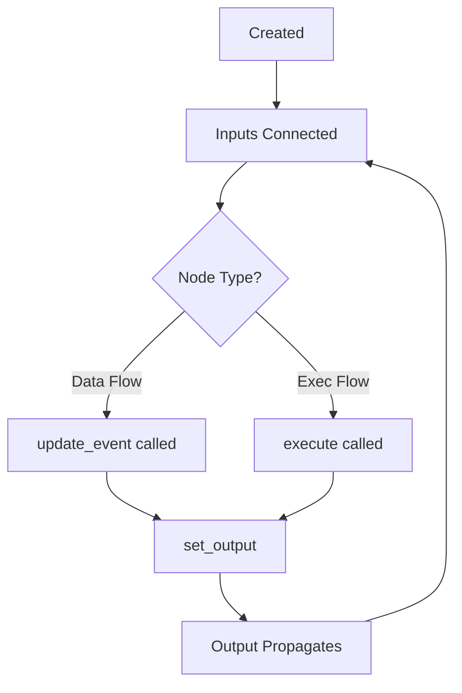

# Custom Nodes

This guide covers creating custom nodes for GLIDER's visual flow programming system.

## Node Basics

Nodes are the building blocks of GLIDER experiments. Each node:

- Has **input ports** that receive data or execution triggers
- Has **output ports** that send data or trigger next steps
- Performs an operation when executed or when inputs change

## Node Categories

| Category | Purpose | Base Class |
|----------|---------|------------|
| `HARDWARE` | Device interaction | `HardwareNode` |
| `LOGIC` | Data processing | `LogicNode` or `GliderNode` |
| `INTERFACE` | User interaction | `GliderNode` |
| `SCRIPT` | Custom code | `GliderNode` |
| `EXPERIMENT` | Flow control | `GliderNode` |

## Creating a Simple Node

### Data Flow Node

Processes data reactively when inputs change:

```python
from glider.nodes.base_node import GliderNode, NodeCategory

class MultiplyNode(GliderNode):
    """Multiplies two numbers."""

    title = "Multiply"
    category = NodeCategory.LOGIC

    def __init__(self):
        super().__init__()
        # Add data inputs
        self.add_input("a", data_type="float", default=0.0)
        self.add_input("b", data_type="float", default=1.0)
        # Add data output
        self.add_output("result", data_type="float")

    def update_event(self):
        """Called when any input changes."""
        a = self.get_input(0) or 0.0
        b = self.get_input(1) or 1.0
        self.set_output(0, a * b)
```

### Execution Flow Node

Executes as part of the flow sequence:

```python
from glider.nodes.base_node import GliderNode, NodeCategory

class PrintNode(GliderNode):
    """Prints a message to the log."""

    title = "Print"
    category = NodeCategory.LOGIC

    def __init__(self):
        super().__init__()
        # Execution ports
        self.add_exec_input("exec")
        self.add_exec_output("next")
        # Data input
        self.add_input("message", data_type="str", default="Hello")

    async def execute(self):
        """Called when execution reaches this node."""
        message = self.get_input(0)
        print(f"[GLIDER] {message}")
        # Trigger next node
        self.exec_output(0)
```

## Port Types

### Data Ports

Pass values between nodes:

```python
# Input port
self.add_input(
    name="value",           # Port name
    data_type="float",      # Type hint
    default=0.0,            # Default value
    description="Input value"  # Tooltip
)

# Output port
self.add_output(
    name="result",
    data_type="float",
    description="Computed result"
)
```

**Data Types:**
- `"float"` - Decimal numbers
- `"int"` - Integers
- `"bool"` - True/False
- `"str"` - Text
- `"any"` - Any type
- `"list"` - List of values
- `"dict"` - Dictionary

### Execution Ports

Control flow sequence:

```python
# Execution input (triggers this node)
self.add_exec_input("exec")

# Execution output (triggers next node)
self.add_exec_output("next")

# Multiple outputs for branching
self.add_exec_output("true_branch")
self.add_exec_output("false_branch")
```

## Node Lifecycle



### Lifecycle Methods

| Method | When Called | Purpose |
|--------|-------------|---------|
| `__init__` | Node created | Define ports |
| `update_event` | Input data changes | Process data flow |
| `execute` | Execution reaches node | Process exec flow |
| `start` | Experiment starts | Initialize state |
| `stop` | Experiment stops | Cleanup |

## Hardware Nodes

Nodes that interact with devices:

```python
from glider.nodes.base_node import HardwareNode, NodeCategory

class DigitalWriteNode(HardwareNode):
    """Writes a digital value to a pin."""

    title = "Digital Write"
    category = NodeCategory.HARDWARE

    def __init__(self):
        super().__init__()
        self.add_exec_input("exec")
        self.add_exec_output("next")
        self.add_input("value", data_type="bool", default=False)

    async def hardware_operation(self):
        """Called when executing hardware interaction."""
        value = self.get_input(0)
        if self.device:
            await self.device.execute_action("set", value)

    async def execute(self):
        await self.hardware_operation()
        self.exec_output(0)
```

### Device Binding

Hardware nodes can be bound to devices:

```python
class SensorReadNode(HardwareNode):
    """Reads a sensor value."""

    # Specify compatible device types
    compatible_devices = ["AnalogInput", "TemperatureSensor"]

    async def hardware_operation(self):
        if self.device:
            value = await self.device.read()
            self.set_output(0, value)
```

## Advanced Patterns

### Conditional Branching

```python
class IfNode(GliderNode):
    """Branches based on condition."""

    title = "If"
    category = NodeCategory.LOGIC

    def __init__(self):
        super().__init__()
        self.add_exec_input("exec")
        self.add_exec_output("true")
        self.add_exec_output("false")
        self.add_input("condition", data_type="bool")

    async def execute(self):
        condition = self.get_input(0)
        if condition:
            self.exec_output(0)  # True branch
        else:
            self.exec_output(1)  # False branch
```

### Looping

```python
class ForLoopNode(GliderNode):
    """Executes body N times."""

    title = "For Loop"
    category = NodeCategory.LOGIC

    def __init__(self):
        super().__init__()
        self.add_exec_input("exec")
        self.add_exec_output("body")
        self.add_exec_output("done")
        self.add_input("count", data_type="int", default=10)
        self.add_output("index", data_type="int")

    async def execute(self):
        count = self.get_input(0) or 10
        for i in range(count):
            self.set_output(0, i)
            self.exec_output(0)  # Execute body
            await asyncio.sleep(0)  # Yield
        self.exec_output(1)  # Done
```

### State Management

```python
class CounterNode(GliderNode):
    """Counts trigger events."""

    title = "Counter"
    category = NodeCategory.LOGIC

    def __init__(self):
        super().__init__()
        self.add_exec_input("increment")
        self.add_exec_input("reset")
        self.add_exec_output("next")
        self.add_output("count", data_type="int")
        self._count = 0

    def start(self):
        """Reset on experiment start."""
        self._count = 0
        self.set_output(0, self._count)

    async def execute(self):
        # Check which input triggered
        trigger = self._last_exec_input
        if trigger == 0:  # increment
            self._count += 1
        elif trigger == 1:  # reset
            self._count = 0
        self.set_output(0, self._count)
        self.exec_output(0)
```

### Async Operations

```python
class DelayNode(GliderNode):
    """Waits for specified duration."""

    title = "Delay"
    category = NodeCategory.LOGIC

    def __init__(self):
        super().__init__()
        self.add_exec_input("exec")
        self.add_exec_output("next")
        self.add_input("seconds", data_type="float", default=1.0)

    async def execute(self):
        seconds = self.get_input(0) or 1.0
        await asyncio.sleep(seconds)
        self.exec_output(0)
```

## Properties and Configuration

### Node Properties

Add configurable properties:

```python
class ConfigurableNode(GliderNode):
    """Node with properties."""

    # Properties appear in Properties panel
    property_names = ["mode", "threshold"]

    def __init__(self):
        super().__init__()
        self.mode = "auto"
        self.threshold = 0.5

    def get_state(self) -> dict:
        """Save property state."""
        return {
            "mode": self.mode,
            "threshold": self.threshold,
        }

    def set_state(self, state: dict):
        """Restore property state."""
        self.mode = state.get("mode", "auto")
        self.threshold = state.get("threshold", 0.5)
```

### Visible in Runner

Mark nodes for Runner dashboard:

```python
class DisplayNode(GliderNode):
    """Displays a value in Runner."""

    # Can be shown in Runner dashboard
    can_show_in_runner = True

    def __init__(self):
        super().__init__()
        self.visible_in_runner = True
        self.runner_widget_size = "normal"  # small, normal, large
```

## Error Handling

Handle errors gracefully:

```python
class SafeNode(GliderNode):
    """Demonstrates error handling."""

    async def execute(self):
        try:
            result = await self.risky_operation()
            self.set_output(0, result)
            self.clear_error()
        except Exception as e:
            self.set_error(str(e))
            # Optionally continue flow
            self.exec_output(0)

    def set_error(self, message: str):
        """Set error state (shows in GUI)."""
        self._error = message

    def clear_error(self):
        """Clear error state."""
        self._error = None
```

## Testing Nodes

### Unit Tests

```python
import pytest
from my_plugin.nodes import MultiplyNode

def test_multiply_node():
    node = MultiplyNode()

    # Set inputs
    node._inputs[0].value = 3.0
    node._inputs[1].value = 4.0

    # Trigger update
    node.update_event()

    # Check output
    assert node._outputs[0].value == 12.0

def test_multiply_with_default():
    node = MultiplyNode()

    # Only set one input
    node._inputs[0].value = 5.0

    node.update_event()

    # b defaults to 1.0
    assert node._outputs[0].value == 5.0
```

### Async Tests

```python
import pytest
import asyncio
from my_plugin.nodes import DelayNode

@pytest.mark.asyncio
async def test_delay_node():
    node = DelayNode()
    node._inputs[0].value = 0.1  # 100ms

    start = asyncio.get_event_loop().time()
    await node.execute()
    elapsed = asyncio.get_event_loop().time() - start

    assert elapsed >= 0.1
```

## Registration

Register nodes for use in GLIDER:

```python
# In plugin __init__.py
from glider.core.flow_engine import FlowEngine

# Automatic registration
NODE_TYPES = {
    "MultiplyNode": MultiplyNode,
    "PrintNode": PrintNode,
}

# Or manual registration
def setup():
    FlowEngine.register_node("MultiplyNode", MultiplyNode)
    FlowEngine.register_node("PrintNode", PrintNode)
```

## Best Practices

1. **Clear Naming**: Use descriptive names for nodes and ports
2. **Sensible Defaults**: Provide useful default values
3. **Error Handling**: Handle edge cases gracefully
4. **Documentation**: Add docstrings and descriptions
5. **Async Awareness**: Use `async/await` for I/O operations
6. **State Cleanup**: Reset state in `start()` method
7. **Type Safety**: Use appropriate data types for ports

## See Also

- [Plugin Development](plugin-development.md) - Package as plugin
- [API Reference: Flow](../api-reference/flow.md) - FlowEngine API
- [Built-in Nodes](../api-reference/nodes.md) - Reference implementation
