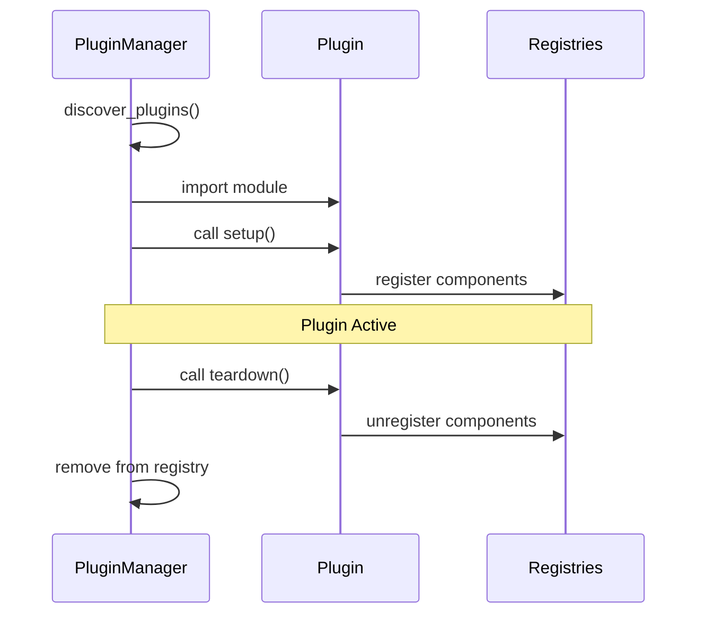

# Plugin Development

This guide covers creating plugins to extend GLIDER with custom drivers, devices, and nodes.

## Overview

GLIDER's plugin system allows you to add:

- **Board Drivers**: Support for new hardware platforms
- **Device Types**: New sensor or actuator abstractions
- **Node Types**: Custom flow graph nodes
- **UI Components**: Dashboard widgets (future)

## Plugin Structure

A GLIDER plugin is a Python package with a specific structure:

```
my_glider_plugin/
├── __init__.py          # Plugin entry point
├── manifest.json        # Plugin metadata (optional)
├── drivers/             # Custom board drivers
│   └── my_board.py
├── devices/             # Custom device types
│   └── my_sensor.py
└── nodes/               # Custom node types
    └── my_node.py
```

## Quick Start

### Minimal Plugin

Create a simple plugin that registers a custom node:

```python
# my_plugin/__init__.py
"""My GLIDER Plugin - Adds custom functionality."""

from glider.nodes.base_node import GliderNode, NodeCategory

class MyCustomNode(GliderNode):
    """A simple custom node."""

    title = "My Node"
    category = NodeCategory.LOGIC

    def __init__(self):
        super().__init__()
        self.add_input("value", data_type="float")
        self.add_output("result", data_type="float")

    def update_event(self):
        value = self.get_input(0)
        if value is not None:
            self.set_output(0, value * 2)

# Registration
NODE_TYPES = {
    "MyCustomNode": MyCustomNode,
}

def setup():
    """Called when plugin loads."""
    print("My plugin loaded!")

def teardown():
    """Called when plugin unloads."""
    print("My plugin unloaded!")
```

### Installing the Plugin

**Method 1: Plugin Directory**

Copy to `~/.glider/plugins/my_plugin/`

**Method 2: Entry Points**

Add to your package's `pyproject.toml`:

```toml
[project.entry-points."glider.node"]
my_custom_node = "my_plugin:MyCustomNode"
```

## Plugin Discovery

GLIDER discovers plugins from two sources:

### 1. Entry Points

Standard Python packaging mechanism:

```toml
# pyproject.toml
[project.entry-points."glider.driver"]
my_board = "my_plugin.drivers:MyBoard"

[project.entry-points."glider.device"]
my_sensor = "my_plugin.devices:MySensor"

[project.entry-points."glider.node"]
my_node = "my_plugin.nodes:MyNode"
```

### 2. Plugin Directory

Local plugins in `~/.glider/plugins/`:

```
~/.glider/plugins/
└── my_plugin/
    ├── __init__.py
    └── manifest.json
```

## Manifest File

Optional metadata file for directory plugins:

```json
{
  "name": "My GLIDER Plugin",
  "version": "1.0.0",
  "description": "Adds custom functionality to GLIDER",
  "author": "Your Name",
  "entry_point": "my_plugin:setup",
  "plugin_type": "generic",
  "requirements": [
    "some-dependency>=1.0.0"
  ],
  "enabled": true
}
```

### Manifest Fields

| Field | Required | Description |
|-------|----------|-------------|
| `name` | Yes | Display name |
| `version` | No | Semantic version |
| `description` | No | Brief description |
| `author` | No | Author name/email |
| `entry_point` | No | Module:function to call |
| `plugin_type` | No | "driver", "device", "node", or "generic" |
| `requirements` | No | pip dependencies |
| `enabled` | No | Whether to load (default: true) |

## Registration Patterns

### Automatic Registration

Define module-level dictionaries that GLIDER discovers:

```python
# __init__.py

# Board drivers
BOARD_DRIVERS = {
    "my_board": MyBoardClass,
}

# Device types
DEVICE_TYPES = {
    "my_sensor": MySensorClass,
}

# Node types
NODE_TYPES = {
    "my_node": MyNodeClass,
}
```

### Manual Registration

Use the setup function for more control:

```python
def setup():
    """Called when plugin loads."""
    from glider.core.hardware_manager import HardwareManager
    from glider.core.flow_engine import FlowEngine
    from glider.hal.base_device import DEVICE_REGISTRY

    # Register driver
    HardwareManager.register_driver("my_board", MyBoardClass)

    # Register device
    DEVICE_REGISTRY["my_sensor"] = MySensorClass

    # Register node
    FlowEngine.register_node("my_node", MyNodeClass)
```

## Async Setup

For plugins that need async initialization:

```python
async def setup():
    """Async setup function."""
    await initialize_hardware()
    await load_calibration_data()

async def teardown():
    """Async cleanup function."""
    await save_state()
    await close_connections()
```

GLIDER detects async functions and awaits them appropriately.

## Plugin Lifecycle



### Lifecycle Hooks

| Hook | When Called | Purpose |
|------|-------------|---------|
| `setup()` | Plugin loads | Register components |
| `teardown()` | Plugin unloads | Cleanup resources |

## Error Handling

Plugins should handle errors gracefully:

```python
def setup():
    try:
        import optional_dependency
        # Use dependency
    except ImportError:
        import logging
        logging.warning("Optional dependency not available")
        # Provide fallback or skip features
```

GLIDER catches plugin exceptions and logs them:

```
WARNING - Plugin 'my_plugin' failed to load: ImportError: No module named 'xyz'
```

## Dependencies

### Declaring Dependencies

In `manifest.json`:
```json
{
  "requirements": ["numpy>=1.20.0", "scipy"]
}
```

### Installing Dependencies

```bash
# GLIDER can install plugin requirements
glider --install-plugin-deps my_plugin
```

Or manually:
```bash
pip install -r ~/.glider/plugins/my_plugin/requirements.txt
```

## Testing Plugins

### Unit Testing

```python
# test_my_plugin.py
import pytest
from my_plugin import MyCustomNode

def test_node_doubles_value():
    node = MyCustomNode()
    node._inputs[0].value = 5.0
    node.update_event()
    assert node._outputs[0].value == 10.0
```

### Integration Testing

```python
import pytest
from glider.core.glider_core import create_core

@pytest.mark.asyncio
async def test_plugin_loads():
    core = await create_core()
    await core.initialize()

    # Check plugin registered
    assert "my_node" in core.get_available_node_types()
```

## Best Practices

### Naming

- Use clear, descriptive names
- Prefix with your organization/project
- Avoid conflicts with built-in types

### Versioning

- Follow semantic versioning
- Document breaking changes
- Support version migration if needed

### Documentation

- Include docstrings on all public classes
- Provide usage examples
- Document configuration options

### Performance

- Lazy-load heavy dependencies
- Cache expensive computations
- Use async for I/O operations

## Example: Complete Plugin

Here's a complete example plugin that adds a temperature sensor:

```python
# temperature_plugin/__init__.py
"""Temperature sensor plugin for GLIDER."""

__version__ = "1.0.0"

from glider.hal.base_device import BaseDevice, DeviceConfig
from glider.nodes.base_node import GliderNode, NodeCategory

# ============================================================
# Device: Temperature Sensor
# ============================================================

class TemperatureSensor(BaseDevice):
    """DHT22 temperature and humidity sensor."""

    device_type = "TemperatureSensor"
    required_pins = ["data"]

    async def initialize(self):
        pin = self.config.pins.get("data")
        await self.board.set_pin_mode(pin, "INPUT")
        self._initialized = True

    async def read_temperature(self) -> float:
        """Read temperature in Celsius."""
        # Implementation depends on hardware
        pin = self.config.pins.get("data")
        raw = await self.board.read_digital(pin)
        return self._convert_to_celsius(raw)

    async def read_humidity(self) -> float:
        """Read relative humidity percentage."""
        # Implementation
        return 50.0

    def _convert_to_celsius(self, raw):
        # Conversion logic
        return 25.0

# ============================================================
# Node: Read Temperature
# ============================================================

class ReadTemperatureNode(GliderNode):
    """Read temperature from a sensor."""

    title = "Read Temperature"
    category = NodeCategory.HARDWARE

    def __init__(self):
        super().__init__()
        self.add_exec_input("exec")
        self.add_exec_output("next")
        self.add_output("celsius", data_type="float")
        self.add_output("fahrenheit", data_type="float")

    async def execute(self):
        if self.device:
            celsius = await self.device.read_temperature()
            fahrenheit = celsius * 9/5 + 32
            self.set_output(0, celsius)
            self.set_output(1, fahrenheit)
        self.exec_output(0)

# ============================================================
# Registration
# ============================================================

DEVICE_TYPES = {
    "TemperatureSensor": TemperatureSensor,
}

NODE_TYPES = {
    "ReadTemperature": ReadTemperatureNode,
}

def setup():
    """Initialize plugin."""
    import logging
    logging.info("Temperature plugin loaded")

def teardown():
    """Cleanup plugin."""
    pass
```

## See Also

- [Custom Nodes](custom-nodes.md) - Detailed node development
- [Custom Drivers](custom-drivers.md) - Board driver development
- [Custom Devices](custom-devices.md) - Device type development
- [API Reference: Plugins](../api-reference/plugins.md) - PluginManager API
