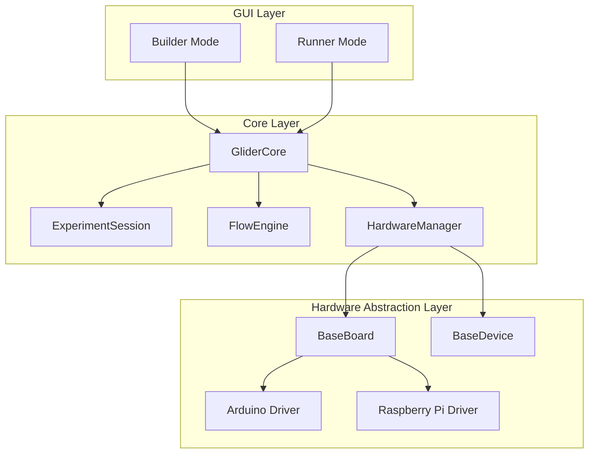
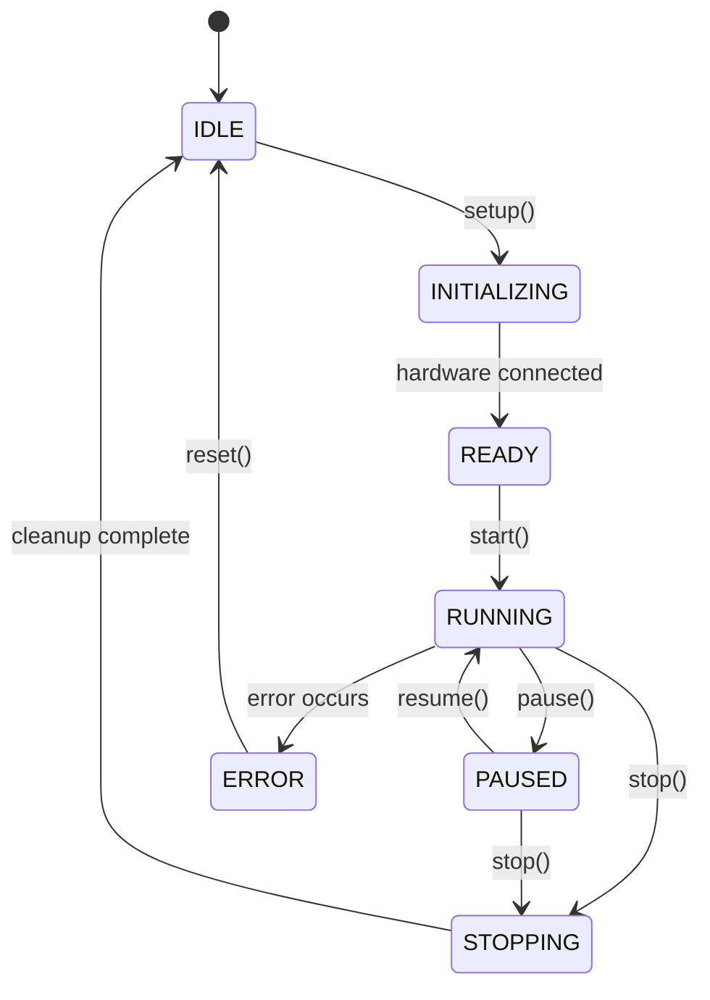
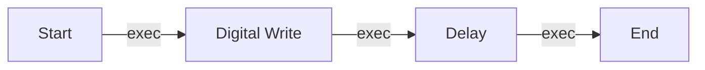
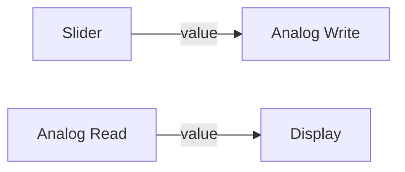

# Core Concepts

Understanding GLIDER's architecture and key concepts will help you create more effective experiments.

## Overview

GLIDER is built around three core ideas:

1. **Visual Flow Programming** - Create logic by connecting nodes
2. **Hardware Abstraction** - Unified interface for different hardware
3. **Separation of Design and Execution** - Builder mode for creation, Runner mode for execution

## Architecture Overview



## Experiments and Sessions

### Experiment Session

An **ExperimentSession** is a complete experiment definition containing:

- **Metadata**: Name, description, author, timestamps
- **Hardware Configuration**: Boards and devices
- **Flow Graph**: Nodes and connections
- **Dashboard Configuration**: Runner mode layout

Sessions are saved as `.glider` files (JSON format).

### Session States

An experiment progresses through these states:



## Flow Programming

### Nodes

**Nodes** are the building blocks of experiments. Each node:

- Has **input ports** (left side) that receive data or execution triggers
- Has **output ports** (right side) that send data or trigger next steps
- Performs a specific operation when executed

### Node Categories

| Category | Purpose | Examples |
|----------|---------|----------|
| **Experiment** | Flow control | Start, End, Delay |
| **Hardware** | Device interaction | Digital Write, Analog Read |
| **Logic** | Data processing | Add, Compare, If/Else |
| **Interface** | User interaction | Button, Slider, Display |
| **Script** | Custom code | Python Script |

### Connection Types

GLIDER uses two types of connections:

#### Execution Flow (White Connections)



- Controls **when** nodes execute
- Flows from left to right
- Like a program's control flow

#### Data Flow (Colored Connections)



- Passes **values** between nodes
- Updates automatically when source changes
- Color indicates data type (blue=number, green=bool, etc.)

### Execution Model

1. **Start Node** triggers first
2. Execution flows along **exec** connections
3. When a node needs input data, it **pulls** from connected data sources
4. Data sources may trigger updates that **push** to connected nodes

## Hardware Abstraction

### Boards

A **Board** represents a physical hardware platform:

- **Arduino**: Microcontroller boards (Uno, Nano, Mega)
- **Raspberry Pi**: Single-board computers with GPIO

Boards are registered via drivers and provide:
- Connection management
- Pin capabilities
- Low-level I/O operations

### Devices

A **Device** is a higher-level abstraction over pins:

| Device Type | Description | Example Use |
|-------------|-------------|-------------|
| DigitalOutput | On/Off control | LED, Relay |
| DigitalInput | On/Off sensing | Button, Switch |
| AnalogInput | Value sensing | Potentiometer, Sensor |
| PWMOutput | Variable output | Motor speed, LED brightness |
| Servo | Angle control | Servo motor |

Devices:
- Are associated with a specific board
- Use one or more pins
- Provide named actions (on, off, read, etc.)

### Pin Management

The **PinManager** prevents conflicts:

- Tracks which pins are in use
- Validates pin capabilities
- Prevents double-allocation

## User Interface Modes

### Builder Mode (Desktop)

The full IDE for creating experiments:

- **Node Graph Canvas**: Visual flow editor
- **Node Library**: Drag-and-drop node palette
- **Hardware Panel**: Board and device management
- **Properties Panel**: Node configuration
- **Toolbar**: Common actions

### Runner Mode (Touch)

Optimized for experiment execution:

- **Dashboard**: Large touch-friendly widgets
- **Device Status**: Real-time state display
- **Controls**: Start, Stop, Pause buttons
- **Minimal UI**: Focus on the experiment

Runner mode is automatically selected on small/touch screens (480x800).

## Data Recording

GLIDER automatically records experiment data:

- **CSV Format**: Easy to analyze in Excel, Python, R
- **Timestamps**: Precise timing for each sample
- **Device States**: All device values logged
- **Configurable Interval**: Adjust sample rate

Example output:
```csv
timestamp,led_state,sensor_value,motor_speed
2024-01-15T10:30:00.000,1,512,128
2024-01-15T10:30:00.100,1,515,128
2024-01-15T10:30:00.200,0,510,0
```

## Plugin System

GLIDER is extensible through plugins:

### Plugin Types

- **Drivers**: New board types (e.g., ESP32, custom hardware)
- **Devices**: New device types (e.g., stepper motor, display)
- **Nodes**: Custom node types for specific operations

### Plugin Discovery

Plugins are discovered from:
1. Python entry points (installed packages)
2. Plugin directory (`~/.glider/plugins/`)

See the [Plugin Development Guide](../developer-guide/plugin-development.md) for details.

## Key Classes

| Class | Purpose |
|-------|---------|
| `GliderCore` | Main orchestrator, manages lifecycle |
| `ExperimentSession` | Experiment data model |
| `FlowEngine` | Executes the node graph |
| `HardwareManager` | Manages boards and devices |
| `BaseBoard` | Abstract board interface |
| `BaseDevice` | Abstract device interface |
| `GliderNode` | Base class for all nodes |

## Next Steps

- **[Builder Mode](../user-guide/builder-mode.md)** - Learn the IDE interface
- **[Hardware Setup](../user-guide/hardware-setup.md)** - Configure your hardware
- **[Architecture](../developer-guide/architecture.md)** - Deep dive into the design
- **[API Reference](../api-reference/core.md)** - Complete API documentation
