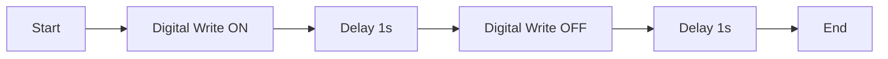
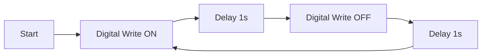

# Quick Start Guide

Create and run your first GLIDER experiment in 5 minutes.

## Prerequisites

- GLIDER installed ([Installation Guide](installation.md))
- Arduino with Telemetrix firmware uploaded
- An LED connected to pin 13 (or use the built-in LED)

## Step 1: Launch GLIDER

Open a terminal and run:

```bash
glider --builder
```

This opens GLIDER in Builder mode - the desktop IDE for creating experiments.


## Step 2: Add Hardware

1. Connect your Arduino via USB
2. In the **Hardware** panel (left side), click **Add Board**
3. Select **Arduino** as the board type
4. Choose the correct COM port (e.g., COM3 or /dev/ttyUSB0)
5. Click **Connect**

The status indicator should turn green when connected.

## Step 3: Add a Device

1. In the Hardware panel, right-click your board
2. Select **Add Device > Digital Output**
3. Name it "LED"
4. Set the pin to **13**
5. Click **Create**

## Step 4: Create the Flow Graph

Now let's create a simple blink pattern:

### Add Start Node
1. In the **Node Library** (right panel), expand **Experiment**
2. Drag **Start** onto the canvas

### Add Digital Write Nodes
1. Expand **Hardware** in the Node Library
2. Drag two **Digital Write** nodes onto the canvas
3. Position them to the right of Start

### Add Delay Nodes
1. Expand **Logic** in the Node Library
2. Drag two **Delay** nodes onto the canvas
3. Position them between the Digital Write nodes

### Add End Node
1. Drag an **End** node from **Experiment**
2. Position it at the far right

## Step 5: Connect the Nodes

Connect the nodes by dragging from output ports (right side) to input ports (left side):



1. Drag from **Start** → **exec** to **Digital Write** → **exec**
2. Continue connecting all nodes in sequence

## Step 6: Configure the Nodes

Click each **Digital Write** node and set properties in the Properties panel:

**First Digital Write (LED ON):**
- Device: LED
- Value: HIGH (checked)

**Second Digital Write (LED OFF):**
- Device: LED
- Value: LOW (unchecked)

**Delay Nodes:**
- Duration: 1.0 seconds each

## Step 7: Run the Experiment

1. Click the **Run** button in the toolbar (or press F5)
2. Watch your LED blink on and off!
3. Click **Stop** to end the experiment

## What You Built

Congratulations! You just created a complete experiment that:

1. Starts execution
2. Turns the LED ON
3. Waits 1 second
4. Turns the LED OFF
5. Waits 1 second
6. Ends

## Step 8: Save Your Experiment

1. Go to **File > Save As**
2. Choose a location and name (e.g., `blink.glider`)
3. Click **Save**

Your experiment is saved as a `.glider` file that you can open later.

## Next Steps

Now that you've created your first experiment, explore more:

- **[Core Concepts](concepts.md)** - Understand how GLIDER works
- **[Creating Experiments](../user-guide/creating-experiments.md)** - Advanced flow graph techniques
- **[Hardware Setup](../user-guide/hardware-setup.md)** - Add more devices
- **[Built-in Nodes](../api-reference/nodes.md)** - Explore all available nodes

## Example: Adding a Loop

Want the LED to blink continuously? Modify your flow:



Instead of connecting to **End**, connect the last **Delay** back to the first **Digital Write** to create a loop.

> **Tip:** Use the **Loop** node from Logic category for more controlled iteration with a specified count.

## Troubleshooting

### LED Not Blinking

1. Check that the board shows "Connected" (green indicator)
2. Verify the pin number matches your LED connection
3. Ensure the Device is selected in both Digital Write nodes

### "Board Not Found" Error

1. Check USB connection
2. Verify Telemetrix firmware is uploaded
3. Try **Hardware > Rescan Ports**

### Nodes Not Connecting

- Ensure you're connecting compatible ports:
  - **Exec** (white) → **Exec** (white) for flow control
  - **Data** (colored) → **Data** (same color) for values
