# Creating Experiments

This guide covers designing experiments using GLIDER's visual flow programming interface.

## Experiment Structure

Every GLIDER experiment has three components:

1. **Hardware Configuration**: Boards and devices
2. **Flow Graph**: Logic using connected nodes
3. **Dashboard Configuration**: Runner mode display

## Planning Your Experiment

Before building, consider:

1. **What hardware do you need?**
   - Which boards (Arduino, Pi)?
   - What devices (sensors, actuators)?
   - How are they connected?

2. **What is the logic flow?**
   - What triggers the start?
   - What actions occur?
   - What conditions control flow?
   - When does it end?

3. **What data do you want to capture?**
   - Which values to record?
   - What sample rate?
   - What output format?

## Building the Flow Graph

### Starting Point

Every experiment needs a **Start** node:

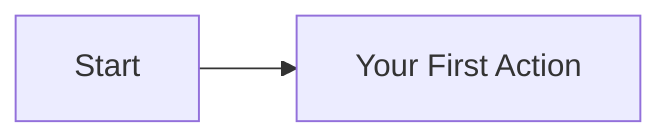

The Start node has:
- No inputs (it's the entry point)
- One exec output (triggers when experiment begins)

### Adding Actions

Drag nodes from the Node Library and connect them:

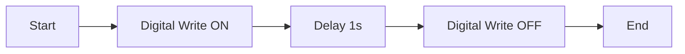

### Connection Types

#### Execution Flow (White)

Controls **when** nodes execute:

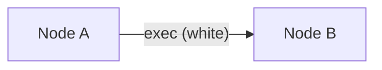

- Connects exec outputs to exec inputs
- Forms the "program flow"
- Only one path executes at a time

#### Data Flow (Colored)

Passes **values** between nodes:

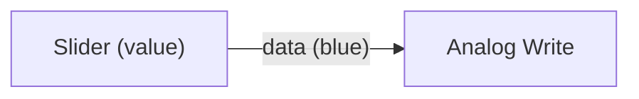

- Connects data outputs to data inputs
- Values update automatically
- Multiple connections allowed from one output

### Ending an Experiment

Use the **End** node or let execution complete:

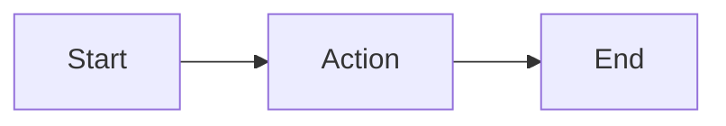

Without End, execution stops when no more exec outputs are triggered.

## Common Patterns

### Simple Sequence

Execute actions in order:

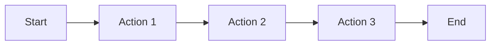

### Conditional Branch

Execute different paths based on conditions:

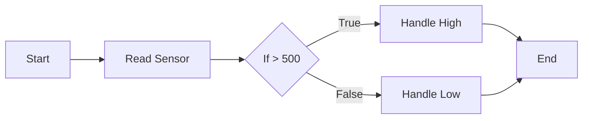

### Looping

Repeat actions a number of times:

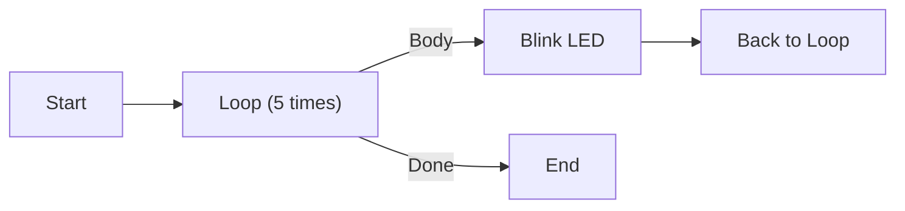

Or repeat until a condition:

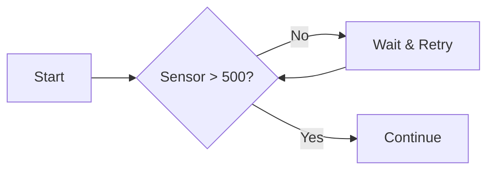

### Parallel Monitoring

Use data flow for continuous monitoring alongside execution flow:

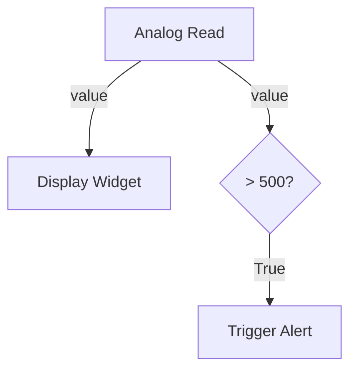

## Working with Hardware Nodes

### Digital Write

Controls digital outputs (LEDs, relays):

**Properties:**
- **Device**: Select configured device
- **Value**: HIGH (on) or LOW (off)

**Ports:**
- Input: exec (triggers write)
- Input: value (optional, overrides property)
- Output: exec (continues flow)

### Digital Read

Reads digital inputs (buttons, switches):

**Properties:**
- **Device**: Select configured device

**Ports:**
- Input: exec (triggers read)
- Output: exec (continues flow)
- Output: value (boolean result)

### Analog Write (PWM)

Controls PWM outputs (motor speed, LED brightness):

**Properties:**
- **Device**: Select configured device
- **Value**: 0-255 (duty cycle)

**Ports:**
- Input: exec
- Input: value (0-255)
- Output: exec

### Analog Read

Reads analog inputs (sensors):

**Properties:**
- **Device**: Select configured device

**Ports:**
- Input: exec
- Output: exec
- Output: value (0-1023)

## Working with Logic Nodes

### Math Operations

Perform calculations on data:

| Node | Operation | Example |
|------|-----------|---------|
| Add | A + B | 5 + 3 = 8 |
| Subtract | A - B | 10 - 4 = 6 |
| Multiply | A × B | 3 × 4 = 12 |
| Divide | A ÷ B | 10 ÷ 2 = 5 |
| Modulo | A % B | 10 % 3 = 1 |

### Comparison Nodes

Compare values for conditions:

| Node | Comparison | Example |
|------|------------|---------|
| Equal | A == B | 5 == 5 → true |
| Not Equal | A != B | 5 != 3 → true |
| Less Than | A < B | 3 < 5 → true |
| Greater Than | A > B | 5 > 3 → true |

### Flow Control

Control execution paths:

**If Node:**
- Branches based on boolean input
- True path: when condition is true
- False path: when condition is false

**Loop Node:**
- Repeats body a specified number of times
- Provides current iteration index
- Done output when complete

**Delay Node:**
- Pauses execution for specified duration
- Doesn't block other data updates

## Interface Nodes

### Display Widgets

Show values in Runner mode:

- **Value Display**: Shows number or text
- **Gauge**: Circular value indicator
- **Graph**: Time-series plot

### Input Widgets

Accept user input during execution:

- **Button**: Trigger actions on press
- **Slider**: Adjust numeric values
- **Toggle**: On/off switch

### Configuring for Runner

1. Select a node
2. Check **Visible in Runner** in Properties
3. Configure widget size and style

## Advanced Techniques

### Using Variables

Store and retrieve values:

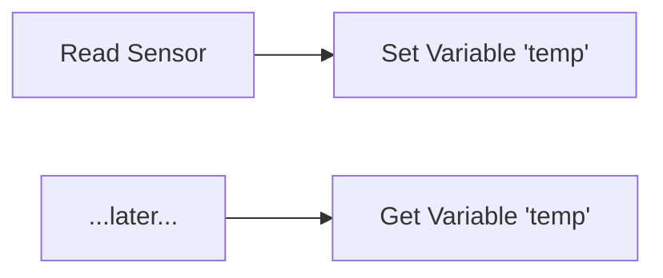

### Sub-flows

Create reusable node groups:

1. Select multiple nodes
2. Right-click → **Create Sub-flow**
3. Name the sub-flow
4. Use it like any other node

### Script Nodes

For complex logic, use Python scripts:

```python
# Available: inputs[], outputs[], device
value = inputs[0]
result = value * 2 + 10
outputs[0] = result
```

> **Warning:** Script nodes can execute arbitrary code. Only use trusted scripts.

## Validation

Before running, validate your experiment:

1. Go to **Flow → Validate** (or press F7)
2. Check for errors:
   - Unconnected required inputs
   - Invalid device references
   - Type mismatches
3. Fix any issues reported

## Saving Experiments

### Save Format

Experiments save as `.glider` files (JSON):

```json
{
  "metadata": { "name": "My Experiment", ... },
  "hardware": { "boards": [...], "devices": [...] },
  "flow": { "nodes": [...], "connections": [...] },
  "dashboard": { "widgets": [...] }
}
```

### Best Practices

- Use descriptive names
- Add descriptions in metadata
- Save versions for significant changes
- Keep experiments focused (one purpose each)

## Tips and Tricks

### Organization

- **Align nodes**: Use grid snapping
- **Add comments**: Use Comment nodes liberally
- **Group related nodes**: Keep logic sections together
- **Use consistent naming**: LED1, LED2 not LED, Light

### Debugging

- **Watch data flow**: Enable value display on connections
- **Add displays**: Use Display nodes to show intermediate values
- **Test incrementally**: Build and test in small steps
- **Use validation**: Check before every run

### Performance

- **Minimize polling**: Don't read faster than needed
- **Batch operations**: Combine related writes
- **Use appropriate delays**: Add delays in tight loops

## See Also

- [Running Experiments](running-experiments.md) - Execute your creation
- [Built-in Nodes](../api-reference/nodes.md) - All available nodes
- [Custom Nodes](../developer-guide/custom-nodes.md) - Create your own
