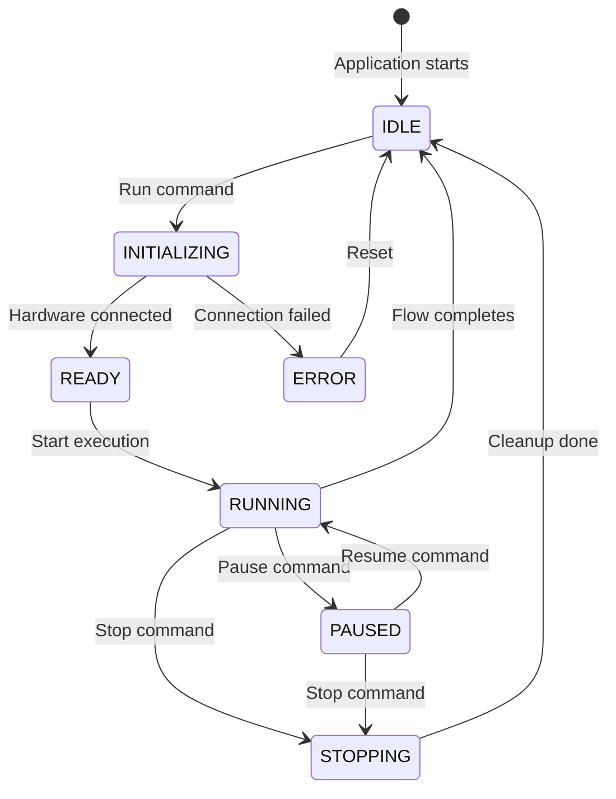

# Running Experiments

This guide covers executing experiments, monitoring progress, and handling issues.

## Pre-Run Checklist

Before starting an experiment:

- [ ] Hardware connected and showing green status
- [ ] All required devices configured
- [ ] Flow graph validated (no errors)
- [ ] Data recording configured (if needed)
- [ ] Safety precautions in place

## Starting an Experiment

### From Builder Mode

1. Click the **Run** button in toolbar
2. Or press **F5**
3. Or go to **Flow → Run**

### From Runner Mode

1. Tap the **START** button
2. Dashboard widgets become active

### From Command Line

```bash
# Open and run immediately
glider --file experiment.glider --run

# Run in Runner mode
glider --runner --file experiment.glider --run
```

## Experiment States



### State Descriptions

| State | Description | Actions Available |
|-------|-------------|-------------------|
| **IDLE** | No experiment loaded or ready | Load, Open |
| **INITIALIZING** | Setting up hardware | Wait, Cancel |
| **READY** | Hardware ready, waiting to start | Start, Configure |
| **RUNNING** | Experiment executing | Pause, Stop, Monitor |
| **PAUSED** | Temporarily halted | Resume, Stop |
| **STOPPING** | Shutting down safely | Wait |
| **ERROR** | Something went wrong | Reset, Diagnose |

## Monitoring During Execution

### Status Indicators

**Builder Mode:**
- Status bar shows current state
- Node graph shows active node (highlighted)
- Connection shows data values (if enabled)

**Runner Mode:**
- Large status indicator
- Elapsed time counter
- Recording indicator (if active)

### Live Data Display

Enable value display on connections:
1. Right-click a connection
2. Select **Show Value**
3. Current value appears on the line

Or use Display nodes for dashboard visibility.

### Hardware Status

Watch the Hardware Panel for:
- Connection status (green = connected)
- Device states (updates during run)
- Error indicators (red = problem)

## Controlling Execution

### Pause

Temporarily halt execution:
- Click **Pause** button
- Or press **F6**
- State changes to PAUSED
- Outputs remain in last state

### Resume

Continue from paused state:
- Click **Resume** button
- Or press **F6** again
- Execution continues from pause point

### Stop

End the experiment:
- Click **Stop** button
- Or press **Shift+F5**
- All outputs set to safe state
- State returns to IDLE

### Emergency Stop

Immediately halt all hardware:
- Click **Emergency Stop** (red button)
- Or press **Ctrl+Shift+Escape**
- All outputs immediately set LOW/OFF
- No graceful shutdown

Use for safety-critical situations.

## Handling Errors

### Common Error Types

**Hardware Disconnection:**
```
Error: Board 'arduino1' disconnected
```
- Check USB/network connection
- Reconnect hardware
- Reset experiment

**Device Error:**
```
Error: Failed to write to device 'LED'
```
- Verify device is configured
- Check pin assignment
- Ensure hardware supports operation

**Flow Error:**
```
Error: Division by zero in node 'Calculate'
```
- Check input values
- Add validation before operations
- Handle edge cases

### Error Recovery

1. **Automatic Recovery** (if enabled):
   - GLIDER attempts reconnection
   - Experiment pauses during recovery
   - Resumes when connection restored

2. **Manual Recovery**:
   - Stop the experiment
   - Fix the issue (reconnect, reconfigure)
   - Start again

3. **Safe State**:
   - All outputs go to safe values
   - No uncontrolled behavior
   - Manual intervention required

### Configuring Error Handling

In experiment settings:

```
Error Handling:
  [ ] Auto-reconnect on disconnect
  [ ] Pause on error (don't stop)
  [x] Set safe state on stop
  [ ] Log errors to file
```

## Performance Monitoring

### Timing

View execution timing:
- **Elapsed Time**: Total run duration
- **Node Execution Time**: Per-node statistics
- **Loop Frequency**: Iterations per second

Access via **View → Performance Monitor**.

### Resource Usage

Monitor system resources:
- CPU usage
- Memory consumption
- USB/serial bandwidth

High resource usage may indicate:
- Too-frequent polling
- Memory leaks in scripts
- Excessive logging

## Logging

### Log Levels

| Level | Description |
|-------|-------------|
| DEBUG | Detailed execution trace |
| INFO | Normal operations |
| WARNING | Non-fatal issues |
| ERROR | Failures requiring attention |

### Viewing Logs

**In Application:**
- **View → Show Log**
- Real-time scrolling log

**Log Files:**
- Location: `~/.glider/logs/`
- Format: `glider_YYYY-MM-DD.log`

### Debug Mode

For troubleshooting, run with debug logging:

```bash
glider --debug --file experiment.glider
```

## Batch Execution

### Running Multiple Experiments

```bash
# Run experiments in sequence
for exp in exp1.glider exp2.glider exp3.glider; do
    glider --file "$exp" --run --headless
done
```

### Headless Mode

Run without GUI (for automation):

```bash
glider --headless --file experiment.glider --run
```

Useful for:
- Automated testing
- Server deployment
- Scheduled experiments

## Safety Considerations

### Before Running

- Verify all connections are secure
- Ensure safe physical setup
- Have emergency stop accessible
- Inform others of experiment

### During Execution

- Monitor for unexpected behavior
- Keep emergency stop ready
- Don't modify hardware while running

### Safe State Configuration

Configure safe values for each device:

| Device Type | Default Safe State |
|-------------|-------------------|
| Digital Output | LOW (off) |
| PWM Output | 0% duty cycle |
| Servo | Center (90°) |

Override in device settings if needed.

## Best Practices

### Preparation

1. **Test incrementally**: Run partial experiments first
2. **Validate flow**: Check for errors before running
3. **Verify hardware**: Ensure all connections work
4. **Document setup**: Record physical configuration

### During Runs

1. **Monitor actively**: Watch for issues
2. **Use pausing**: Debug without restarting
3. **Check logs**: Review for warnings
4. **Record observations**: Note unexpected behavior

### After Completion

1. **Review data**: Check recorded values
2. **Save results**: Export data for analysis
3. **Document findings**: Update experiment notes
4. **Clean up**: Disconnect if done

## See Also

- [Data Recording](data-recording.md) - Capture experiment data
- [Troubleshooting](../reference/troubleshooting.md) - Common issues
- [Builder Mode](builder-mode.md) - Create experiments
